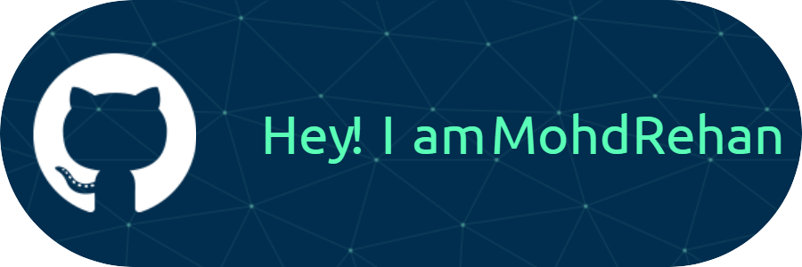

---

  I am currently a junior, pursuing my Bachelors in A.I 🎓 from Z.H.C.E.T, A.M.U. 🏢 I am deeply passionate about Machine Learning and Data Science, constantly exploring new technologies and applying my knowledge to solve real-world problems. Dive into my journey as I navigate through the vast world of data and AI tech stacks.🛠

---

  

---

<h2 align='center'>🔧 Tools and Technologies 🔧</h2>

  <!-- Language and Tools Badges -->
  
  
  
  
  
  
  
  
  
  
  
  
  
  
  
  

---

<h3 align='center'>🤝 Connect with Me 🤝</h3>

  
  
  

---
